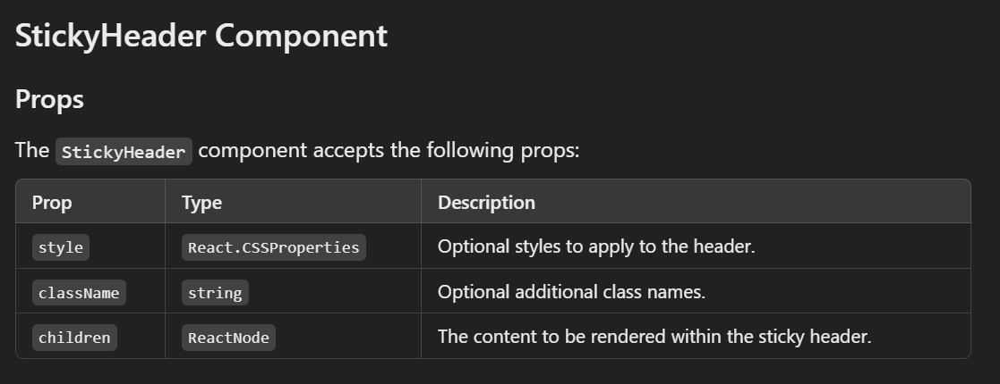

# @swapnesh.io/stickyheader

A simple and reusable React component that renders its children within a sticky header with predefined CSS and JavaScript.

## Installation

To install the package, use one of the following commands:

```bash
npm install @swapnesh.io/stickyheader
yarn add @swapnesh.io/stickyheader
pnpm add @swapnesh.io/stickyheader


Here’s the complete README.md file, all in one place, ready for you to copy and paste:

markdown
Copy code
# @swapnesh.io/stickyheader

A simple and reusable React component that renders its children within a sticky header with predefined CSS and JavaScript.

## Installation

To install the package, use one of the following commands:

```bash
npm install @swapnesh.io/stickyheader

yarn add @swapnesh.io/stickyheader

pnpm add @swapnesh.io/stickyheader


Usage
Wrap your header or navigation component within the StickyHeader component to make it sticky.

import React from 'react';
import StickyHeader from '@swapnesh.io/stickyheader';
import HeaderComponent from './HeaderComponent'; // Import your header component

const App = () => {
  const styles = {
    // Your custom styles here
  };

  return (
    <StickyHeader>
      <HeaderComponent style={styles} className="classnames">
        {/* Your header content */}
      </HeaderComponent>
    </StickyHeader>
  );
};

export default App;



License
This project is licensed under the MIT License - see the LICENSE file for details.